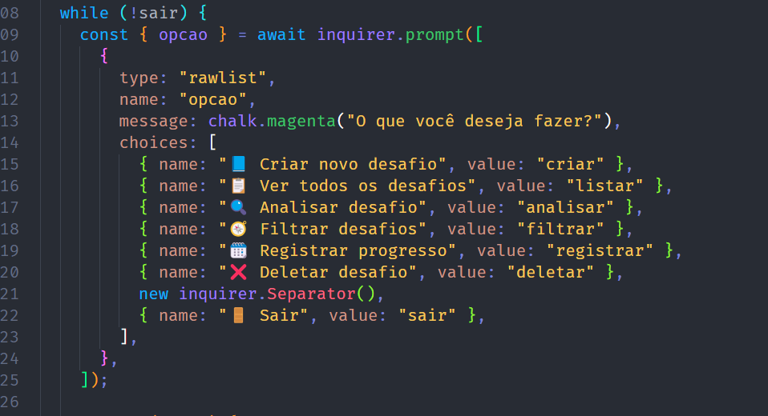

# [Desafios pessoais]

## Descrição
Cria desafios para serem completos diariamente

## Funcionalidades
- [ ] Funcionalidade 1
- [ ] Funcionalidade 2
- [ ] ...

## Como Executar
1. Clone o repositório
3. Execute `npm install`
4. Execute `node script.js`

## Tecnologias Utilizadas
- Node.js
- @inquirer/prompts
- File System (fs)

## Estrutura de Dados
Inicialmente deve-se declarar as variáveis(const...), fazer funções com as necessidade específicas(function ...),usar as estruturas de controle e usar entrada(console.log) e saida (prompt) de dados,além disso ainda é importante destacar a importancia dos operadores(+,-,*...).

## Capturas de Tela

## Autor
Igor Ryan Wachholz
email:igor_walchholz@estudante.sesisenai.org.br

## Aprendizados
aprendi a declarar funções, constantes fazer um menu no terminal usar estrutura de dados, entrada e saida de dados, operadores e aplicar os conhecimentos de javascript.

### Link dos slides
https://www.canva.com/design/DAG1DWRtgBA/Neos5Rlp9Qe9QiMGEvxWGQ/edit?utm_content=DAG1DWRtgBA&utm_campaign=designshare&utm_medium=link2&utm_source=sharebutton

