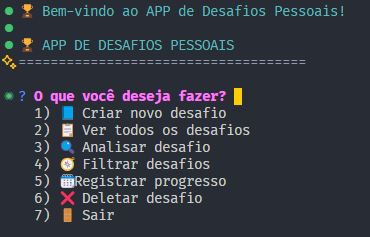

# [Desafios pessoais]

## Descrição
Cria desafios para serem completos diariamente

## Funcionalidades

 Criar novo desafio (nome, duração e descrição)

 Registrar progresso diário (cumprido ou não)

 Calcular sequência atual e maior sequência (streak)

 Exibir lista completa de desafios

 Analisar um desafio específico (estatísticas e desempenho)

 Atualizar ou excluir desafios

 Sistema de persistência (salva tudo em desafios.json)

 Backup automático de dados

 Menu interativo via terminal com inquirer

 Validações e feedbacks visuais com chalk

## Como Executar
1. Clone o repositório
3. Execute `npm install`
4. Execute `node script.js`

## Tecnologias Utilizadas

Node.js — ambiente de execução
Inquirer.js — menus interativos no terminal
Chalk — interface colorida e feedback visual
File System (fs.promises) — leitura e gravação do banco local (desafios.json)
JSON — estrutura de dados persistente

## Estrutura de Dados
{
  id: 1,
  nome: "30 Dias de Exercício",
  descricao: "Fazer pelo menos 30 min de exercício por dia",
  duracao: 30,
  dataInicio: "2024-01-01",
  dataFim: "2024-01-30",
  status: "ativo",
  progresso: [
    { dia: 1, data: "2024-01-01", cumprido: true, observacao: "Corrida 40 min" },
    { dia: 2, data: "2024-01-02", cumprido: false, observacao: "Chuva, não consegui" }
  ],
  sequenciaAtual: 1,
  maiorSequencia: 5,
  estatisticas: {
    diasCumpridos: 25,
    diasFalhados: 5,
    porcentagemSucesso: 83.3
  },
  conquistas: []
}

## Capturas de Tela

## Autor
Igor Ryan Wachholz
email:igor_walchholz@estudante.sesisenai.org.br

## Aprendizados
aprendi a declarar funções, constantes fazer um menu no terminal usar estrutura de dados, entrada e saida de dados, operadores e aplicar os conhecimentos de javascript.

### Link dos slides
https://www.canva.com/design/DAG1DWRtgBA/Neos5Rlp9Qe9QiMGEvxWGQ/edit?utm_content=DAG1DWRtgBA&utm_campaign=designshare&utm_medium=link2&utm_source=sharebutton

